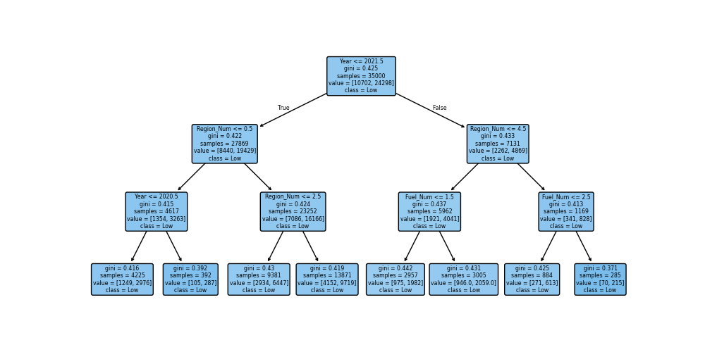

# Projeto: Classificação de Vendas de Carros BMW com Árvore de Decisão

## Etapas

* [x] Exploração dos Dados (EDA)
* [x] Pré-processamento
* [x] Divisão dos Dados
* [x] Treinamento do Modelo
* [x] Avaliação do Modelo
* [x] Relatório Final

## Diagrama do Projeto


---

## 1. Exploração dos Dados (EDA)

Nesta etapa, foi realizada a análise exploratória do dataset [BMW_Car.csv](https://www.kaggle.com/dataset/hsumedh1507/bmw-car-sales-dataset), verificando as primeiras linhas, informações gerais, estatísticas descritivas, valores ausentes e visualização das variáveis categóricas.

=== "Output"
    ```
    **Primeiras 5 linhas do dataset:**

      Model  Year         Region  Color Fuel_Type Transmission  Engine_Size_L  \
    0  5 Series  2016           Asia    Red    Petrol       Manual            3.5   
    1        i8  2013  North America    Red    Hybrid    Automatic            1.6   
    2  5 Series  2022  North America   Blue    Petrol    Automatic            4.5   
    3        X3  2024    Middle East   Blue    Petrol    Automatic            1.7   
    4  7 Series  2020  South America  Black    Diesel       Manual            2.1   

    Mileage_KM  Price_USD  Sales_Volume Sales_Classification  
    0      151748      98740          8300                 High  
    1      121671      79219          3428                  Low  
    2       10991     113265          6994                  Low  
    3       27255      60971          4047                  Low  
    4      122131      49898          3080                  Low 

    **Estatísticas descritivas:**

           Model          Year Region  Color Fuel_Type Transmission  \
    count      50000  50000.000000  50000  50000     50000        50000   
    unique        11           NaN      6      6         4            2   
    top     7 Series           NaN   Asia    Red    Hybrid       Manual   
    freq        4666           NaN   8454   8463     12716        25154   
    mean         NaN   2017.015700    NaN    NaN       NaN          NaN   
    std          NaN      4.324459    NaN    NaN       NaN          NaN   
    min          NaN   2010.000000    NaN    NaN       NaN          NaN   
    25%          NaN   2013.000000    NaN    NaN       NaN          NaN   
    50%          NaN   2017.000000    NaN    NaN       NaN          NaN   
    75%          NaN   2021.000000    NaN    NaN       NaN          NaN   
    max          NaN   2024.000000    NaN    NaN       NaN          NaN   

            Engine_Size_L     Mileage_KM      Price_USD  Sales_Volume  \
    count    50000.000000   50000.000000   50000.000000  50000.000000   
    unique            NaN            NaN            NaN           NaN   
    top               NaN            NaN            NaN           NaN   
    freq              NaN            NaN            NaN           NaN   
    mean         3.247180  100307.203140   75034.600900   5067.514680   
    std          1.009078   57941.509344   25998.248882   2856.767125   
    min          1.500000       3.000000   30000.000000    100.000000   
    25%          2.400000   50178.000000   52434.750000   2588.000000   
    50%          3.200000  100388.500000   75011.500000   5087.000000   
    75%          4.100000  150630.250000   97628.250000   7537.250000   
    max          5.000000  199996.000000  119998.000000   9999.000000   

        Sales_Classification  
    count                 50000  
    unique                    2  
    top                     Low  
    freq                  34754  
    mean                    NaN  
    std                     NaN  
    min                     NaN  
    25%                     NaN  
    50%                     NaN  
    75%                     NaN  
    max                     NaN  

    **Valores ausentes por coluna:**
    
    Model                   0
    Year                    0
    Region                  0
    Color                   0
    Fuel_Type               0
    Transmission            0
    Engine_Size_L           0
    Mileage_KM              0
    Price_USD               0
    Sales_Volume            0
    Sales_Classification    0
    ```

=== "Code"
    ```python
    import pandas as pd
    import numpy as np
    import matplotlib.pyplot as plt
    import seaborn as sns

    # Carregar o dataset
    data = pd.read_csv('docs/arvore-de-decisao/data/BMW_Car.csv')

    # Análise exploratória inicial
    print("Primeiras 5 linhas do dataset:")
    print(data.head())

    print("\nInformações do dataset:")
    print(data.info())

    print("\nEstatísticas descritivas:")
    print(data.describe(include='all'))

    print("\nValores ausentes por coluna:")
    print(data.isnull().sum())

    # Visualização das variáveis categóricas
    plt.figure(figsize=(15, 10))

    plt.subplot(2, 2, 1)
    data['Region'].value_counts().head(5).plot(kind='bar')
    plt.title('Top 5 Regiões')
    plt.xticks(rotation=45)

    plt.subplot(2, 2, 2)
    data['Fuel_Type'].value_counts().head(5).plot(kind='bar')
    plt.title('Top 5 tipos de Combustível')
    plt.xticks(rotation=45)

    plt.subplot(2, 2, 3)
    data['Transmission'].value_counts().plot.pie(autopct='%1.1f%%', figsize=(6,6))
    plt.ylabel('')  # Remove o label do eixo Y

    plt.tight_layout()
    plt.savefig('./docs/arvore-de-decisao/categorical_distribution.png')
    plt.show()

    print(data.columns.tolist())
    ```

=== "Gráfico"
    

=== "Explicação"

    * O dataset contém informações sobre vendas de carros BMW, incluindo variáveis categóricas como região, tipo de combustível e transmissão.

    * Foram analisadas as primeiras linhas, estatísticas e valores ausentes.

    * Gráficos de barra e pizza foram utilizados para visualizar as principais categorias.

---

## 2. Pré-processamento

Como visto anteriormente, na etapa de exploração do dataset, não temos variáveis com valores ausentes. Logo, não se torna necessário fazer a substituição destes valores. No entanto, temos algumas variáveis categóricas que precisam ser transformadas em numéricas usando o Label Encoding e o One-Hot Encoding.

**Label Encoding** -> serve para variáveis categóricas que não são binárias.

**One-Hot Encoding** -> serve para variáveis binárias. 0-sim/true e 1-não/false.

=== "Output"
    ```
          Model  Year         Region   Color Fuel_Type  Engine_Size_L  Mileage_KM  \
    0  5 Series  2016           Asia     Red    Petrol            3.5      151748
    1        i8  2013  North America     Red    Hybrid            1.6      121671
    2  5 Series  2022  North America    Blue    Petrol            4.5       10991
    3        X3  2024    Middle East    Blue    Petrol            1.7       27255
    4  7 Series  2020  South America   Black    Diesel            2.1      122131
    5  5 Series  2017    Middle East  Silver    Diesel            1.9      171362
    6        i8  2022         Europe   White    Diesel            1.8      196741
    7        M5  2014           Asia   Black    Diesel            1.6      121156
    8        X3  2016  South America   White    Diesel            1.7       48073
    9        i8  2019         Europe   White  Electric            3.0       35700

    Price_USD  Sales_Volume  Model_Num  Region_Num  Color_Num  Fuel_Num  \
    0      98740          8300          1           1          3         3   
    1      79219          3428         10           4          3         2   
    2     113265          6994          1           4          1         3   
    3      60971          4047          6           3          1         3   
    4      49898          3080          2           5          0         0   
    5      42926          1232          1           3          4         0   
    6      55064          7949         10           2          5         0   
    7     102778           632          4           1          0         0   
    8     116482          8944          6           5          5         0   
    9      96257          4411         10           2          5         1   

    Transmission_Manual  Sales_Classification_Low  
    0                 True                     False  
    1                False                      True  
    2                False                      True  
    3                False                      True  
    4                 True                      True  
    5                 True                      True  
    6                 True                     False  
    7                False                      True  
    8                False                     False  
    9                 True                      True 
    ```

=== "Code"

    ```python
    import pandas as pd
    import matplotlib.pyplot as plt
    from sklearn.metrics import classification_report
    from sklearn.preprocessing import LabelEncoder
    from sklearn.model_selection import train_test_split
    from sklearn.tree import DecisionTreeClassifier, plot_tree

    data = pd.read_csv("docs/arvore-de-decisao/data/BMW_Car.csv")

    # Label Encoding
    data['Model_Num'] = LabelEncoder().fit_transform(data['Model'])
    data['Region_Num'] = LabelEncoder().fit_transform(data['Region'])
    data['Color_Num'] = LabelEncoder().fit_transform(data['Color'])
    data['Fuel_Num'] = LabelEncoder().fit_transform(data['Fuel_Type'])

    # One-Hot Encoding
    data = pd.get_dummies(data, columns=['Transmission', 'Sales_Classification'], drop_first=True)

    print(data.head(10))
    ```

=== "Explicação"

    * Variáveis categóricas foram transformadas em numéricas para uso no modelo.

    * Se tivesse valores nulos, em variáveis numéricas seriam preenchidos com a mediana; em categóricas, com a moda.

    * O dataset ficou pronto para o treinamento do modelo.

---

## 3. Divisão dos Dados

Mas afinal, que hipótese eu quero comprovar??

A minha hipótese consiste que fatores técnicos como o ano do veículo, tipo de combustível, câmbio e fatores regionais são determinantes para prever se um carro terá baixa classificação de vendas.

Com o intuito de ver se minha hipótese é verdadeira ou não, eu treinei o meu modelo dividindo os dados em conjuntos de treino e teste (70% por 30%).

=== "Code"

    ```python
    # Seleção das features e target
    features = ['Year','Region_Num', 'Fuel_Num', 'Transmission_Manual']
    x = data[features]
    y = data['Sales_Classification_Low']

    # Divisão dos dados
    X_train, X_test, y_train, y_test = train_test_split(x, y, test_size=0.3, random_state=42)
    ```

=== "Explicação"

    * As variáveis de entrada (features -> variáveis x) e saída (target -> variável y) foram definidas.

    * Split 70/30 para treino e teste, garantindo avaliação justa do modelo.

---

## 4. Treinamento do Modelo

O modelo de árvore de decisão foi treinado com os dados de treino.

=== "Code"

    ```python
    clf = DecisionTreeClassifier(random_state=42, max_depth=3)
    clf.fit(X_train, y_train)
    ```

=== "Explicação"

    * Utilizou-se o `DecisionTreeClassifier` com profundidade máxima de 3 para evitar overfitting.

    * O modelo foi ajustado aos dados de treino.

---

## 5. Avaliação do Modelo

O desempenho do modelo foi avaliado com métricas de classificação e visualização da árvore.

=== "Output"

    ```
    Relatório de classificação:
                precision    recall  f1-score   support

        False       0.00      0.00      0.00      4544
        True       0.70      1.00      0.82     10456

        accuracy                           0.70     15000
    macro avg       0.35      0.50      0.41     15000
    weighted avg       0.49      0.70      0.57     15000
    ```

=== "Code"

    ```python
    # Previsão e avaliação
    y_pred = clf.predict(X_test)
    print("Relatório de classificação:\n", classification_report(y_test, y_pred))

    # Visualização da árvore
    plt.figure(figsize=(10,5))
    tree = plot_tree(clf, feature_names=features, class_names=['Not Low','Low'], filled=True, rounded=True)
    plt.savefig('./docs/arvore-de-decisao/arvore.png')
    plt.show()
    ```

=== "Gráfico"
    

=== "Explicação"

    * O modelo foi avaliado por métricas como precisão, recall e F1-score.

    * A árvore de decisão foi visualizada para interpretação dos resultados.

---

## 6. Relatório Final

Concluo que, a análise realizada por meio da árvore de decisão mostrou que fatores técnicos, como o ano de fabricação e o tipo de combustível, além de fatores regionais, influenciam diretamente na classificação de vendas dos veículos, confirmando em grande parte a hipótese inicial. O modelo evidenciou que carros mais antigos apresentam maior propensão a serem classificados como de baixa venda, enquanto em veículos mais recentes o tipo de combustível e a região se tornam mais determinantes. Apesar disso, o relatório de classificação revelou que o modelo possui limitações, uma vez que ele prioriza prever corretamente os casos de baixa venda (Recall = 1,00), mas não consegue identificar com precisão os casos de não baixa venda, refletindo o desbalanceamento presente no conjunto de dados. Dessa forma, conclui-se que a árvore de decisão se mostrou útil para confirmar as hipóteses propostas e identificar padrões relevantes, mas ainda há espaço para aprimoramentos, como o balanceamento das classes ou ajustes nos parâmetros do modelo, para garantir previsões mais equilibradas e robustas.
