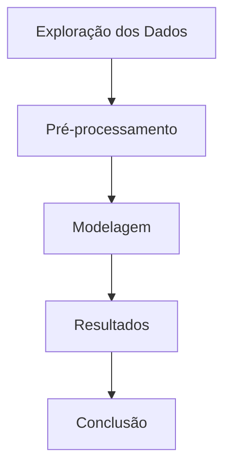

# Conceitos básicos

Estes são os conceitos da matéria de Machine Learning para que eu conseguisse elaborar os exercícios cobrados na matéria.

## Sobre IA

A Inteligência Artificial serve para automatizar a mão de obra humana. Ela pode ser categorizada em:

1. **Symbolic IA**: se concentra em representar o conhecimento da IA por meio de símbolos e regras. Usamos aqui o conhecimento do primeiro semestre da tabela verdade para saber se uma proposição é verdadeira ou falsa.

2. **Connectionist AI**: é a IA baseada em redes neurais e se concentra em cálculos e inferências matemáticas.

3. **Neuro-Symbolic AI**: é a intersecção entre o raciocínio simbólico com as redes neurais, o que potencializa os pontos fortes das outras IA's para que a Neuro-Symbolic AI consiga resolver problemas complexos e ao mesmo tempo aprender com os dados.


## Machine Learning

**Mas, o que é o Machine Learning?**

Esta técnica serve para que a máquina aprenda a partir dos dados, com o intuito de que o sistema consiga resolver problemas mais complexos e que melhorem seu desemepenho, sem que sejam programados necessariamente o tempo todo de execução.

Dentro do Machine Learning, as técnicas são divididas em duas grandes categorias principais: o aprendizado supervisionado e o aprendizado não supervisionado.

!!! info "Aprendizado supervisionado"

    O *aprendizado supervisionado* é quando treinamos um modelo com uma base de dados rotulados. Isso faz com que o sistema aprenda os padrões e faça previsões com uma base de dados novas e inéditas.

    USADO EM: tarefas de classificação e tarefas de regressão. -> abordagem eficaz quando existe uma relação entre as variáveis feature e target.

!!! info "Aprendizado não supervisionado"

    O *aprendizado não supervisionado* envolvde uma base de dados não rotulada, ou seja, o próprio modelo deve encontrar padrões e relacionamentos dentro dos dados que não tem uma orientação explícita.

    USADO EM: análises exploratórias de dados e extração de recursos (clusterização e redução de número de recursos em um conjunto de dados) -> abordagem eficaz quando temos que descobrir estruturas ocultas em uma base de dados.

!!! info "Aprendizado por reforço"

    Essa técnica é mais comumente utilizada quando o sistema precisa tomar decisões sequenciais com o ambiente e receber um feedback na forma de ganho ou perca.

    USADO EM: jogos ou controle robótico.

As técnicas para aprendizado da máquina resolve uma variedade de problemas, e os principais deles são:

* Problema de classificação: envolve a previsão de categorias discretas (valores inteiros) ou rótulos futuros com base na feature.

* Problema de regressão: envolve a previsão de valores contínuos.

## Árvore de decisão

As árvores de decisão são uma técnica popular de aprendizado de máquina supervisionado usada para classificação e regressão. Elas representam decisões e suas possíveis consequências em uma estrutura hierárquica, facilitando a interpretação dos resultados.

[Comparativo Técnico: Label Encoding vs One Hot Encoding](https://blog.dsacademy.com.br/comparativo-tecnico-label-encoding-vs-one-hot-encoding-em-machine-learning/#:~:text=Cada%20t%C3%A9cnica%20possui%20seu%20prop%C3%B3sito,que%20n%C3%A3o%20induz%20rela%C3%A7%C3%B5es%20inexistentes.)

### Etapas da árvore



1. **Exploração dos Dados**: Nesta etapa, os dados são analisados para entender suas características, identificar padrões e detectar possíveis problemas, como valores ausentes ou outliers.

2. **Pré-processamento**: Os dados são limpos e preparados para a modelagem. Isso pode incluir a normalização, transformação de variáveis categóricas em numéricas (usando técnicas como One-Hot Encoding ou Label Encoding), e divisão dos dados em conjuntos de treinamento e teste.

3. **Modelagem**: A árvore de decisão é construída a partir dos dados de treinamento. O algoritmo seleciona as features que melhor dividem os dados em cada nó, com base em critérios como entropia e ganho de informação.

4. **Resultados**: O modelo é avaliado usando o conjunto de teste para medir sua precisão e capacidade de generalização. Métricas como acurácia, precisão, recall e F1-score são comumente usadas.

5. **Conclusão**: Os resultados são interpretados e as decisões são tomadas com base nas previsões do modelo. A árvore de decisão pode ser visualizada para entender como as decisões foram feitas.

### Funcionamento

1. **Divisão Recursiva**: A árvore de decisão começa com um nó raiz que representa todo o conjunto de dados. O algoritmo então divide os dados em subconjuntos com base em uma feature que maximiza a separação entre as classes (para classificação) ou minimiza o erro (para regressão). Esse processo é repetido recursivamente para cada subconjunto, criando nós filhos até que um critério de parada seja atingido (como profundidade máxima da árvore ou número mínimo de amostras em um nó).

2. **Nós e Folhas**: Cada nó interno representa uma decisão baseada em uma feature, enquanto as folhas representam as previsões finais (rótulos de classe ou valores contínuos).

### Vantagens da Árvore de Decisão ✅

* Fácil de interpretar e visualizar.
* Pode lidar com dados categóricos e numéricos.
* Requer pouca preparação de dados.
* Pode capturar relações não lineares.

### Desvantagens da Árvore de Decisão ❌

* Propenso ao overfitting, especialmente com árvores profundas.
* Sensível a pequenas variações nos dados.
* Pode ser instável, pois pequenas mudanças nos dados podem levar a árvores muito diferentes.

### Métricas de Avaliação da Árvore de Decisão

**Entropia**: A entropia é uma medida da incerteza ou impureza em um conjunto de dados. Em termos simples, ela quantifica o grau de desordem ou aleatoriedade em um sistema. Em aprendizado de máquina, a entropia é usada para avaliar a qualidade das divisões em uma árvore de decisão.

**Ganho de Informação**: O ganho de informação é uma métrica que quantifica a redução da entropia após uma divisão dos dados com base em uma feature específica. Em outras palavras, ele mede o quanto a incerteza sobre a variável alvo diminui quando os dados são divididos com base em uma determinada feature. O ganho de informação é calculado como a diferença entre a entropia do conjunto de dados original e a entropia ponderada dos subconjuntos resultantes da divisão.

**Índice Gini**: O índice Gini é uma medida de impureza ou pureza usada em árvores de decisão para avaliar a qualidade das divisões dos dados. Ele quantifica a probabilidade de um elemento ser classificado incorretamente se fosse rotulado aleatoriamente de acordo com a distribuição das classes no conjunto de dados. O índice Gini varia entre 0 (pureza máxima, onde todos os elementos pertencem à mesma classe) e 0,5 (impureza máxima, onde as classes estão igualmente distribuídas).

## KNN (K-Nearest Neighbors)

O KNN é um algoritmo de aprendizado supervisionado usado para problemas de classificação e regressão. Ele é baseado na ideia de que objetos semelhantes estão próximos uns dos outros no espaço de características. É válido ressaltar que o KNN é bom para conjuntos de dados pequenos e médios, e é simples de entender e implementar.

### Funcionamento - KNN

1. **Escolha do K**: O primeiro passo é escolher o número de vizinhos (K) que serão considerados para a classificação ou regressão. Este passo é crucial, pois um valor muito pequeno pode tornar o modelo sensível ao ruído, enquanto um valor muito grande pode suavizar demais as fronteiras de decisão. Para que não haja uma escolha do K equivocada, faz-se a técnica de *validação cruzada*.

2. **Cálculo da Distância**: Para classificar um novo ponto, o algoritmo calcula a distância entre esse ponto e todos os pontos do conjunto de treinamento. As métricas de distâncias mais comuns são a Euclidiana, Manhattan e Minkowski.

3. **Identificação dos Vizinhos**: O algoritmo seleciona os K pontos mais próximos do conjunto de treinamento.

4. **Classificação ou Regressão**:
   * **Classificação**: O rótulo do novo ponto é determinado pelos rótulos frequentes dos K vizinhos. (Ou seja, a moda dos rótulos)
   * **Regressão**: O valor do novo ponto é determinado pela média (ou mediana) dos valores dos K vizinhos.

### Vantagens do KNN ✅

* Simplicidade: O KNN é fácil de entender e implementar.
* Flexibilidade: Pode ser usado para classificação e regressão.
* Não paramétrico: Não faz suposições sobre a distribuição dos dados.

### Desvantagens do KNN ❌

* Custo computacional: O KNN pode ser lento, especialmente com grandes conjuntos de dados, pois precisa calcular a distância de todos os pontos.
* Sensibilidade a ruídos: O algoritmo pode ser afetado por outliers e ruídos nos dados.
* Escolha do K: A escolha do valor de K pode impactar significativamente o desempenho do modelo.

### Métricas de Avaliação

As métricas de avaliação para KNN incluem:

* **Acurácia**: Proporção de previsões corretas em relação ao total de previsões.
* **Precisão**: Proporção de verdadeiros positivos em relação ao total de positivos previstos.
* **Revocação**: Proporção de verdadeiros positivos em relação ao total de positivos reais.
* **F1-Score**: Média harmônica entre precisão e revocação. Util quando há um desequilíbrio entre classes.
* **Matriz de Confusão**: Tabela que mostra o desempenho do modelo, detalhando verdadeiros positivos, falsos positivos, verdadeiros negativos e falsos negativos.

## K-Means

O K-Means é um algoritmo de aprendizado não supervisionado usado para tarefas de clusterização. Ele agrupa dados em K clusters distintos com base na similaridade das características dos dados. O objetivo do K-Means é minimizar a variância dentro de cada cluster, ou seja, os pontos dentro de um cluster devem ser o mais semelhantes possível entre si.

### Funcionamento - K-Means

1. **Inicialização**: O algoritmo começa escolhendo K centróides iniciais aleatórios a partir dos dados.

2. **Atribuição de Cluster**: Cada ponto de dado é atribuído ao cluster cujo centróide está mais próximo. Essa proximidade é geralmente medida usando a distância Euclidiana.

3. **Atualização de Centróides**: Após a atribuição, os centróides de cada cluster são recalculados como a média dos pontos atribuídos a eles.

4. **Convergência**: Os passos 2 e 3 são repetidos até que os centróides não mudem significativamente ou até que um número máximo de iterações seja alcançado.

### Vantagens do K-Means ✅

* Simplicidade: O K-Means é fácil de entender e implementar.
* Escalabilidade: Funciona bem em grandes conjuntos de dados.
* Eficiência: O algoritmo é relativamente rápido, especialmente com implementações otimizadas.

### Desvantagens do K-Means ❌

* Escolha do K: A determinação do número ideal de clusters (K) pode ser desafiadora.
* Sensibilidade a outliers: O K-Means pode ser influenciado por valores extremos.
* Forma dos Clusters: O algoritmo assume que os clusters têm formas esféricas e tamanhos semelhantes, o que nem sempre é o caso na prática.
* Inicialização Aleatória: A escolha inicial dos centróides pode afetar os resultados, levando a diferentes soluções em execuções diferentes.

### Métricas para Avaliação de Clusters

As métricas mais comuns para avaliar a qualidade dos clusters formados pelo K-Means incluem:

* **Inércia**: Mede a soma das distâncias quadráticas entre os pontos e seus respectivos centróides. Menores valores de inércia indicam clusters mais compactos.

* **Silhueta**: Avalia a qualidade dos clusters, considerando a coesão (distância média entre pontos dentro do mesmo cluster) e a separação (distância média entre pontos de diferentes clusters). Valores próximos de 1 indicam clusters bem definidos, enquanto valores próximos de -1 indicam clusters mal definidos.

* **Índice de Dunn**: Mede a razão entre a menor distância entre pontos de diferentes clusters e a maior distância dentro de um cluster. Valores mais altos indicam melhores separações entre clusters.

### Método do Cotovelo (Elbow Method)

O Método do Cotovelo é uma técnica visual usada para determinar o número ideal de clusters (K) em um conjunto de dados ao usar o algoritmo K-Means. A ideia é executar o K-Means para diferentes valores de K e plotar a inércia (soma das distâncias quadráticas entre os pontos e seus respectivos centróides) em função de K. À medida que K aumenta, a inércia tende a diminuir, pois os clusters se tornam mais específicos.

O ponto onde a taxa de diminuição da inércia começa a desacelerar significativamente é chamado de "cotovelo". Esse ponto sugere um valor apropriado para K, pois indica que adicionar mais clusters além desse ponto não resulta em uma melhoria substancial na compactação dos clusters.

```mermaid
graph TD
    A[Inércia] --> B[Cotovelo]
    B --> C[Número Ideal de Clusters (K)]
```

### Aplicações do K-Means

O K-Means é amplamente utilizado em diversas áreas, incluindo:

* **Segmentação de Clientes**: Agrupar clientes com base em comportamentos de compra semelhantes.
* **Compressão de Imagens**: Reduzir o número de cores em uma imagem, agrupando pixels semelhantes.
* **Análise de Texto**: Agrupar documentos ou textos semelhantes para facilitar a busca e a organização.
* **Detecção de Anomalias**: Identificar padrões incomuns em dados, como fraudes financeiras.
* **Agrupamento Geográfico**: Agrupar locais com base em características geográficas ou demográficas.
* **Recomendações de Produtos**: Agrupar produtos semelhantes para melhorar sistemas de recomendação.
* **Análise de Redes Sociais**: Identificar comunidades ou grupos de usuários com interesses semelhantes.
* **Biologia e Genômica**: Agrupar genes ou proteínas com funções semelhantes para facilitar a análise biológica.
* **Marketing**: Identificar segmentos de mercado para campanhas direcionadas.
* **Saúde**: Agrupar pacientes com características semelhantes para personalizar tratamentos médicos.
* **Ciência de Dados**: Explorar e entender grandes conjuntos de dados, identificando padrões e tendências.
* **Finanças**: Agrupar ativos financeiros com comportamentos semelhantes para otimizar portfólios de investimento.
* **Logística**: Otimizar rotas de entrega agrupando destinos próximos.
* **Educação**: Agrupar estudantes com base em desempenho ou estilos de aprendizagem para personalizar o ensino.

## Random Forest

O Random Forest é um algoritmo de aprendizado supervisionado que combina múltiplas árvores de decisão para melhorar a precisão e robustez das previsões. Ele é amplamente utilizado para tarefas de classificação e regressão devido à sua capacidade de lidar com grandes conjuntos de dados e alta dimensionalidade.

### Funcionamento - Random Forest

1. **Construção das Árvores**: O Random Forest constrói várias árvores de decisão a partir de diferentes subconjuntos aleatórios dos dados de treinamento. Cada árvore é treinada em uma amostra bootstrap (amostragem com reposição) dos dados.

2. **Seleção de Recursos**: Durante a construção de cada árvore, um subconjunto aleatório de recursos (features) é selecionado para determinar a melhor divisão em cada nó. Isso ajuda a reduzir a correlação entre as árvores e melhora a generalização do modelo.

3. **Agregação de Resultados**: Para fazer previsões, o Random Forest agrega as previsões de todas as árvores individuais. Para tarefas de classificação, a classe mais frequente entre as árvores é escolhida. Para tarefas de regressão, a média das previsões é calculada.

### Vantagens do Random Forest ✅

* Alta Precisão: Geralmente oferece melhor desempenho do que uma única árvore de decisão.
* Robustez: Menos propenso ao overfitting devido à agregação de múltiplas árvores.
* Capacidade de lidar com dados faltantes e variáveis categóricas.
* Importância das Features: Fornece medidas de importância das features, ajudando na interpretação do modelo.

### Desvantagens do Random Forest ❌

* Complexidade: Mais difícil de interpretar do que uma única árvore de decisão.
* Custo Computacional: Requer mais recursos computacionais para treinamento e previsão.
* Pode ser menos eficaz em conjuntos de dados muito pequenos.

### Métricas de Avaliação do Random Forest

As métricas de avaliação para o Random Forest incluem:

* Acurácia: Proporção de previsões corretas em relação ao total de previsões.
* Precisão: Proporção de verdadeiros positivos em relação ao total de positivos previstos.
* Revocação (Sensibilidade): Proporção de verdadeiros positivos em relação ao total de positivos reais.
* F1-Score: Média harmônica entre precisão e revocação.
* AUC-ROC: Área sob a curva ROC, que mede a capacidade de discriminação do modelo.

---

## Referências

* [Machine Learning Mastery - Decision Trees](https://machinelearningmastery.com/classification-and-regression-trees-for-machine-learning/)
* [Machine Learning Mastery - KNN](https://machinelearningmastery.com/tutorial-to-k-nearest-neighbors-in-python/)
* [Machine Learning Mastery - K-Means](https://machinelearningmastery.com/k-means-clustering-for-machine-learning/)
* [Scikit-Learn - Decision Trees](https://scikit-learn.org/stable/modules/tree.html)
* [Scikit-Learn - KNN](https://scikit-learn.org/stable/modules/neighbors.html)
* [Scikit-Learn - K-Means](https://scikit-learn.org/stable/modules/clustering.html#k-means)
* [Wikipedia - Decision Trees](https://en.wikipedia.org/wiki/Decision_tree)
* [Wikipedia - KNN](https://en.wikipedia.org/wiki/K-nearest_neighbors_algorithm)
* [Wikipedia - K-Means](https://en.wikipedia.org/wiki/K-means_clustering)
* [Towards Data Science - Decision Trees](https://towardsdatascience.com/decision-trees-in-machine-learning-641b9c4e8052)
* [Towards Data Science - KNN](https://towardsdatascience.com/k-nearest-neighbors-knn-algorithm-bd72f3f4f3e7)
* [Towards Data Science - K-Means](https://towardsdatascience.com/k-means-clustering-algorithm-applications-evaluation-methods-and-drawbacks-aa03e644b48a)
* [GeeksforGeeks - Decision Trees](https://www.geeksforgeeks.org/decision-tree-in-machine-learning/)
* [GeeksforGeeks - KNN](https://www.geeksforgeeks.org/k-nearest-neighbors-knn-algorithm-in-python/)
* [GeeksforGeeks - K-Means](https://www.geeksforgeeks.org/k-means-clustering-algorithm-in-python/)
