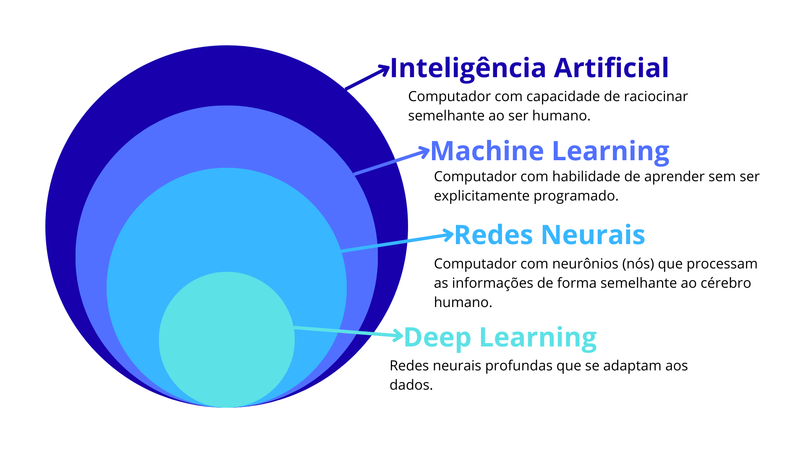
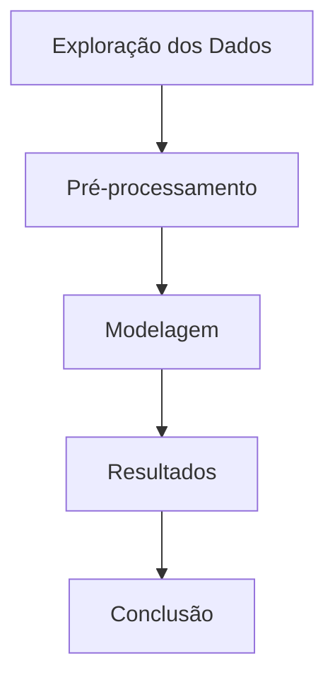

# Conceitos básicos

Estes são os conceitos da matéria de Machine Learning para que eu conseguisse elaborar os exercícios cobrados na matéria.

## Sobre IA

A Inteligência Artificial serve para automatizar a mão de obra humana. Ela pode ser categorizada em:

1. **Symbolic IA**: se concentra em representar o conhecimento da IA por meio de símbolos e regras. Usamos aqui o conhecimento do primeiro semestre da tabela verdade para saber se uma proposição é verdadeira ou falsa.

2. **Connectionist AI**: é a IA baseada em redes neurais e se concentra em cálculos e inferências matemáticas.

3. **Neuro-Symbolic AI**: é a intersecção entre o raciocínio simbólico com as redes neurais, o que potencializa os pontos fortes das outras IA's para que a Neuro-Symbolic AI consiga resolver problemas complexos e ao mesmo tempo aprender com os dados.

## Machine Learning

**Mas, o que é o Machine Learning?**

Esta técnica serve para que a máquina aprenda a partir dos dados, com o intuito de que o sistema consiga resolver problemas mais complexos e que melhorem seu desemepenho, sem que sejam programados necessariamente o tempo todo de execução.

Dentro do Machine Learning, as técnicas são divididas em duas grandes categorias principais: o aprendizado supervisionado e o aprendizado não supervisionado.

!!! info "Aprendizado supervisionado"

    O *aprendizado supervisionado* é quando treinamos um modelo com uma base de dados rotulados. Isso faz com que o sistema aprenda os padrões e faça previsões com uma base de dados novas e inéditas.

    USADO EM: tarefas de classificação e tarefas de regressão. -> abordagem eficaz quando existe uma relação entre as variáveis feature e target.

!!! info "Aprendizado não supervisionado"

    O *aprendizado não supervisionado* envolvde uma base de dados não rotulada, ou seja, o próprio modelo deve encontrar padrões e relacionamentos dentro dos dados que não tem uma orientação explícita.

    USADO EM: análises exploratórias de dados e extração de recursos (clusterização e redução de número de recursos em um conjunto de dados) -> abordagem eficaz quando temos que descobrir estruturas ocultas em uma base de dados.

!!! info "Aprendizado por reforço"

    Essa técnica é mais comumente utilizada quando o sistema precisa tomar decisões sequenciais com o ambiente e receber um feedback na forma de ganho ou perca.

    USADO EM: jogos ou controle robótico.

As técnicas para aprendizado da máquina resolve uma variedade de problemas, e os principais deles são:

* Problema de classificação: envolve a previsão de categorias discretas (valores inteiros) ou rótulos futuros com base na feature.

* Problema de regressão: envolve a previsão de valores contínuos.

## Árvore de decisão

As árvores de decisão são uma técnica popular de aprendizado de máquina supervisionado usada para classificação e regressão. Elas representam decisões e suas possíveis consequências em uma estrutura hierárquica, facilitando a interpretação dos resultados.

### Etapas da árvore

