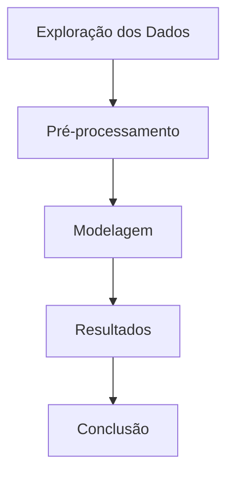

# Conceitos básicos

Estes são os conceitos da matéria de Machine Learning para que eu conseguisse elaborar os exercícios cobrados na matéria.

## Sobre IA

A Inteligência Artificial serve para automatizar a mão de obra humana. Ela pode ser categorizada em:

1. **Symbolic IA**: se concentra em representar o conhecimento da IA por meio de símbolos e regras. Usamos aqui o conhecimento do primeiro semestre da tabela verdade para saber se uma proposição é verdadeira ou falsa.

2. **Connectionist AI**: é a IA baseada em redes neurais e se concentra em cálculos e inferências matemáticas.

3. **Neuro-Symbolic AI**: é a intersecção entre o raciocínio simbólico com as redes neurais, o que potencializa os pontos fortes das outras IA's para que a Neuro-Symbolic AI consiga resolver problemas complexos e ao mesmo tempo aprender com os dados.

## Árvore de decisão

As árvores de decisão são uma técnica popular de aprendizado de máquina supervisionado usada para classificação e regressão. Elas representam decisões e suas possíveis consequências em uma estrutura hierárquica, facilitando a interpretação dos resultados.

### Etapas da árvore

