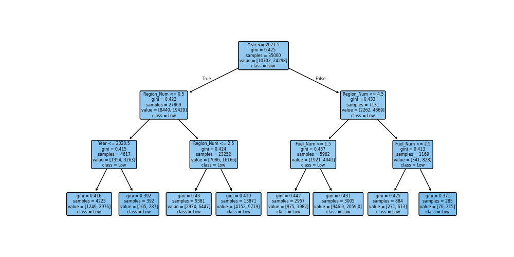

# Projeto

## 1. Exploração dos Dados (EDA)

Nesta etapa, foi realizada a análise exploratória do dataset [heart.csv](https://www.kaggle.com/datasets/ritwikb3/heart-disease-cleveland?resource=download), que contém informações clínicas de pacientes para detecção de doenças cardíacas.

* O dataset possui 303 registros e 14 variáveis, incluindo idade, sexo, tipo de dor no peito, pressão arterial, colesterol, frequência cardíaca máxima, entre outras.

* Foram analisadas as primeiras linhas, estatísticas descritivas e valores ausentes (não há valores ausentes neste conjunto).

* Gráficos de barras foram utilizados para visualizar a distribuição das variáveis categóricas e numéricas, além de uma matriz de correlação para identificar relações entre as variáveis.

=== "Output"

    ```
    Primeiras 5 linhas do dataset:

    age  sex  cp  trestbps  chol  fbs  restecg  thalach  exang  oldpeak  slope  ca  thal  target
    0   63    1   0       145   233    1        2      150      0      2.3      2   0     2       0
    1   67    1   3       160   286    0        2      108      1      1.5      1   3     1       1
    2   67    1   3       120   229    0        2      129      1      2.6      1   2     3       1
    3   37    1   2       130   250    0        0      187      0      3.5      2   0     1       0
    4   41    0   1       130   204    0        2      172      0      1.4      0   0     1       0

    Informações do dataset:
    
    <class 'pandas.core.frame.DataFrame'>
    RangeIndex: 303 entries, 0 to 302
    Data columns (total 14 columns):
    #   Column    Non-Null Count  Dtype
    ---  ------    --------------  -----
    0   age       303 non-null    int64
    1   sex       303 non-null    int64
    2   cp        303 non-null    int64
    3   trestbps  303 non-null    int64
    4   chol      303 non-null    int64
    5   fbs       303 non-null    int64
    6   restecg   303 non-null    int64
    7   thalach   303 non-null    int64
    8   exang     303 non-null    int64
    9   oldpeak   303 non-null    float64
    10  slope     303 non-null    int64
    11  ca        303 non-null    int64
    12  thal      303 non-null    int64
    13  target    303 non-null    int64
    dtypes: float64(1), int64(13)
    memory usage: 33.3 KB
    None

    Estatísticas descritivas:
    
    age         sex          cp    trestbps  ...       slope          ca        thal      targetcount  303.000000  303.000000  303.000000  303.000000  ...  303.000000  303.000000  303.000000  303.000000mean    54.438944    0.679868    2.158416  131.689769  ...    0.600660    0.663366    1.831683    0.458746std      9.038662    0.467299    0.960126   17.599748  ...    0.616226    0.934375    0.956705    0.499120min     29.000000    0.000000    0.000000   94.000000  ...    0.000000    0.000000    1.000000    0.00000025%     48.000000    0.000000    2.000000  120.000000  ...    0.000000    0.000000    1.000000    0.00000050%     56.000000    1.000000    2.000000  130.000000  ...    1.000000    0.000000    1.000000    0.00000075%     61.000000    1.000000    3.000000  140.000000  ...    1.000000    1.000000    3.000000    1.000000max     77.000000    1.000000    3.000000  200.000000  ...    2.000000    3.000000    3.000000    1.000000
    [8 rows x 14 columns]

    Valores ausentes por coluna:
    
    age         0
    sex         0
    cp          0
    trestbps    0
    chol        0
    fbs         0
    restecg     0
    thalach     0
    exang       0
    oldpeak     0
    slope       0
    ca          0
    thal        0
    target      0
    dtype: int64
    ```

=== "Code"

    ```python
    import pandas as pd
    import numpy as np
    import seaborn as sns
    import matplotlib.pyplot as plt

    dados = pd.read_csv('data/heart.csv')

    print("Primeiras 5 linhas do dataset:")
    print(dados.head())
    print("\nInformações do dataset:")
    print(dados.info())
    print("\nEstatísticas descritivas:")
    print(dados.describe(include='all'))
    print("\nValores ausentes por coluna:")
    print(dados.isnull().sum())

    # Visualização das variáveis categóricas
    plt.style.use('ggplot')
    plt.figure(figsize=(15, 10))

    plt.subplot(2, 2, 1)
    sns.countplot(x='target', data=dados)
    plt.title('Distribuição da variável alvo')
    plt.ylabel('Contagem')

    plt.subplot(2, 2, 2)
    sns.countplot(x='sex', data=dados)
    plt.title('Distribuição por Sexo')
    plt.ylabel('Contagem')

    plt.subplot(2, 1, 2)
    sns.countplot(x='cp', data=dados)
    plt.title('Distribuição por Tipo de Dor no Peito')
    plt.ylabel('Contagem')
    plt.xticks(rotation=45)
    plt.tight_layout()
    plt.savefig('./docs/classes/knn/img/distribuicao.png')
    plt.show()

    # Visualização das variáveis numéricas
    plt.figure(figsize=(15, 10))
    plt.subplot(2, 2, 1)
    sns.histplot(dados['age'], bins=20, kde=True)
    plt.title('Distribuição da Idade')
    plt.xlabel('Idade')
    plt.ylabel('Frequência')
    plt.subplot(2, 2, 2)
    sns.histplot(dados['trestbps'], bins=20, kde=True)
    plt.title('Distribuição da Pressão Arterial em Repouso')
    plt.xlabel('Pressão Arterial (mm Hg)')
    plt.ylabel('Frequência')
    plt.subplot(2, 1, 2)
    sns.histplot(dados['chol'], bins=20, kde=True)
    plt.title('Distribuição do Colesterol')
    plt.xlabel('Colesterol (mg/dl)')
    plt.ylabel('Frequência')
    plt.tight_layout()
    plt.savefig('./docs/classes/knn/img/distribuicao_numerica.png')
    plt.show()
    ```

=== "Gráficos"
    
    

---

## 2. Pré-processamento

Feito anteriormente no arquivo [processamento.py](../arvore-de-decisao/processamento.py), o pré-processamento incluiu:
* Tratamento de valores ausentes (não havia valores ausentes neste dataset).
* Normalização de variáveis numéricas (não foi necessário, pois o KNN é baseado em distância e as variáveis já estão em escalas comparáveis).
* Codificação de variáveis categóricas (não há variáveis categóricas neste dataset).
* Criação de variáveis derivadas (não foi necessário).
=== "Code"

    ```python
    from sklearn.model_selection import train_test_split
    from sklearn.preprocessing import StandardScaler
    from sklearn.neighbors import KNeighborsClassifier
    from sklearn.metrics import classification_report, confusion_matrix

    # Carregar dados pré-processados
    data = pd.read_csv('data/heart_preprocessed.csv')
    ```

---

## 3. Divisão dos Dados

Com o intuito de ver se minha hipótese é verdadeira ou não, eu treinei o meu modelo dividindo os dados em conjuntos de treino e teste (70% por 30%).

=== "Code"

    ```python
    # Seleção das features e target
    features = ['Year','Region_Num', 'Fuel_Num', 'Transmission_Manual']
    x = data[features]
    y = data['Sales_Classification_Low']

    # Divisão dos dados
    X_train, X_test, y_train, y_test = train_test_split(x, y, test_size=0.3, random_state=42)
    ```

=== "Explicação"

    * As variáveis de entrada (features -> variáveis x) e saída (target -> variável y) foram definidas.

    * Split 70/30 para treino e teste, garantindo avaliação justa do modelo.

---

## 4. Treinamento do Modelo

O modelo de árvore de decisão foi treinado com os dados de treino.

=== "Code"

    ```python
    clf = DecisionTreeClassifier(random_state=42, max_depth=3)
    clf.fit(X_train, y_train)
    ```

=== "Explicação"

    * Utilizou-se o `DecisionTreeClassifier` com profundidade máxima de 3 para evitar overfitting.

    * O modelo foi ajustado aos dados de treino.

---

## 5. Avaliação do Modelo

O desempenho do modelo foi avaliado com métricas de classificação e visualização da árvore.

=== "Output"

    ```
    Relatório de classificação:
                precision    recall  f1-score   support

        False       0.00      0.00      0.00      4544
        True       0.70      1.00      0.82     10456

        accuracy                           0.70     15000
    macro avg       0.35      0.50      0.41     15000
    weighted avg       0.49      0.70      0.57     15000
    ```

=== "Code"

    ```python
    # Previsão e avaliação
    y_pred = clf.predict(X_test)
    print("Relatório de classificação:\n", classification_report(y_test, y_pred))

    # Visualização da árvore
    plt.figure(figsize=(10,5))
    tree = plot_tree(clf, feature_names=features, class_names=['Not Low','Low'], filled=True, rounded=True)
    plt.savefig('./docs/arvore-de-decisao/arvore.png')
    plt.show()
    ```

=== "Gráfico"
    

=== "Explicação"

    * O modelo foi avaliado por métricas como precisão, recall e F1-score.

    * A árvore de decisão foi visualizada para interpretação dos resultados.

---

Ao avaliar o desempenho do meu modelo de árvore de decisão, vemos que a acurácia ficou em torno de 70%. Isso significa que, de todos os exemplos do conjunto de teste, o modelo acertou 70% das classificações entre “baixa venda” e “não baixa venda”.

No entanto, ao analisar o relatório de classificação, percebemos que o modelo tem um recall de 1.00 para a classe “baixa venda”, ou seja, ele identifica todos os casos de baixa venda corretamente. Por outro lado, para a classe “não baixa venda”, o modelo praticamente não acerta (precision, recall e f1-score são 0). Isso indica que o modelo está priorizando a classe majoritária, provavelmente porque *o dataset está desbalanceado, com muito mais exemplos de baixa venda do que de não baixa venda*.

## 6. Relatório Final

Concluo que, a análise realizada por meio da árvore de decisão mostrou que fatores técnicos, como o ano de fabricação e o tipo de combustível, além de fatores regionais, influenciam diretamente na classificação de vendas dos veículos, confirmando em grande parte a hipótese inicial. O modelo evidenciou que carros mais antigos apresentam maior propensão a serem classificados como de baixa venda, enquanto em veículos mais recentes o tipo de combustível e a região se tornam mais determinantes.

Apesar disso, o relatório de classificação revelou que o modelo possui limitações, uma vez que ele prioriza prever corretamente os casos de baixa venda (Recall = 1,00), mas não consegue identificar com precisão os casos de não baixa venda, refletindo o desbalanceamento presente no conjunto de dados.

Dessa forma, conclui-se que a árvore de decisão se mostrou útil para confirmar as hipóteses propostas e identificar padrões relevantes, mas ainda há espaço para aprimoramentos, como o balanceamento das classes ou ajustes nos parâmetros do modelo, para garantir previsões mais equilibradas e robustas.
