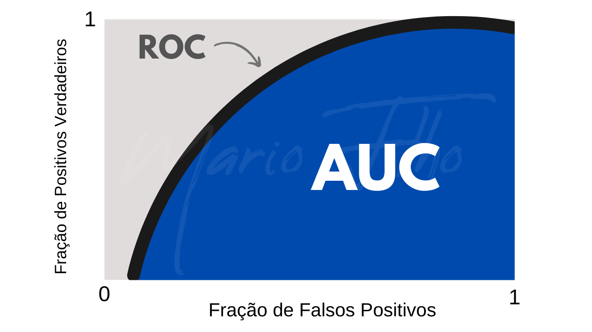

# Métricas de Avaliação

As métricas são divididas cada uma para um problema diferente em Machine Learning.

## Problemas de Classificação

Como já vimos anteriormente, os problemas de classificação são para prever uma categoria. As métricas para avaliar este tipo de problema, precisam avaliar **como** o modelo acerta e não só o **quanto** ele acerta.

**Matriz de Confusão**: É um resumo visual de tudo que o modelo acerta e erra. É dela que surgem outras métricas super importantes.

* Mostra COMO o modelo erra.

A partir desta matriz, podemos obter métricas como:

* **Acurácia** -> percentual de previsões corretas que o modelo faz. A acurácia é boa para utilizar apenas quando as classes estão balanceadas. <mark> (TP + TN) / (TP + FP + TN + FN)</mark>

* **Precisão** -> quantos resultados são verdadeiramente positivos dentro dos resultados que o modelo diz que é positivos?? <mark> TP / (TP + TN)</mark>

* **Recall (Sensibilidade)** -> dentro dos positivos reais, quantos o modelo encontrou? <mark> TP / (TP + FN)</mark>

* **Especificidade** -> entre todos os casos negativos, quantos o modelo encontrou os negativos corretamente? <mark> TN / (TN + FP)</mark>

* **F1-Score** -> é o cálculo entre a precisão e o recall. É uma métrica que serve para equilibrar os dois lados quando nenhum dos lados podem ser sacrificados. <mark> 2 *((precisão * recall) / (precisão + recall))</mark>

**Curva-ROC-AUC**: mede a capacidade do modelo de separar as classes. É ótima para a comparação de modelos.

* Se aumentamos sensibilidade, tende a pegar mais positivos. No entanto, gera mais falsos positivos --> ESPECIFICIDADE CAI.
* Se aumentamos a especificidade, reduzimos falsos positivos. Mas gera o risco de perder positivos --> SENSIBILIDADE CAI.

Esse processo de trade-off é representado na curva com os valores de sensibilidade no eixo Y e os valores de especificidade no eixo X. Logo, a ROC mostra como o recall e a especificidade muda quando se é ajustado o limiar de decisão do modelo.

O AUC quantifica o desempenho geral, sendo que AUC = 1 indica um classificador perfeito e AUC = 0,5 indica um classificador aleatório. Quanto maior o AUC, melhor o modelo separa as classes.

### Resumo

| Métrica        | O que mede? | Quando usar? |
|----------------|-------------|--------------|
| **Matriz de Confusão** | Quantidade de verdadeiros/ falsos positivos/negativos. | Diagnóstico detalhado do comportamento do modelo. |
| **Acurácia**   | Percentual total de acertos do modelo. | Bases balanceadas; avaliação geral simples. |
| **Precisão**   | Entre os positivos previstos, quantos são realmente positivos. | Quando falso positivo é caro (ex.: diagnóstico errado). |
| **Recall (Sensibilidade)** | Entre os positivos reais, quantos o modelo encontrou. | Quando não pode deixar passar casos positivos (ex.: fraudes). |
| **F1-Score**   | Média harmônica entre precisão e recall. | Classes desbalanceadas; equilíbrio entre FP e FN. |
| **ROC-AUC**    | Capacidade do modelo de separar classes variando o limiar. | Comparação de modelos; avaliação geral de separação. |

## Problemas de Regressão

Já os problemas de regressão são para prever valores númericos contínuos. Logo, precisamos saber sobre o **tamanho** do erro, e não se o modelo acertou ou errou.

**MAE (Erro Médio Absoluto)**: É quanto o modelo erra em média.

**MSE (Erro Médio Quadrado)**: Penaliza os grandes erros para uma melhoria na interpretação, pois ele calcula a média dos erros ao quadrado. Seu uso é recomendado quando queremos forte penalizações para outliers.

**RMSE (Raiz do MSE)**: É a raiz quadrada do MSE, que volta a escala original da variável target.

**MAPE (Média Absoluta da Porcentagem do Erro)**: Mede o erro do modelo em porcentagem.

**R² (Coeficiente de Determinação)**: Quanto da variação da variável target o modelo consegue explicar. Escala de 0(modelo não explica nada) a 1(modelo explica 100%).

### Resumo.2

| Métrica        | O que mede? | Quando usar? |
|----------------|-------------|--------------|
| **MAE (Mean Absolute Error)** | Erro médio absoluto entre previsão e valor real. | Fácil interpretação; pouco sensível a outliers. |
| **MSE (Mean Squared Error)**  | Média dos erros ao quadrado. | Quando deseja penalizar fortemente erros grandes. |
| **RMSE (Root Mean Squared Error)** | Raiz do MSE, voltando à escala original do target. | Comparação entre modelos; sensível a outliers. |
| **MAPE (Mean Absolute Percentage Error)** | Erro percentual médio em relação ao valor real. | Quando escala do problema varia muito; interpretação percentual. |
| **R² (Coeficiente de Determinação)** | Proporção da variância explicada pelo modelo. | Avaliação geral de desempenho; comparação com baseline. |
